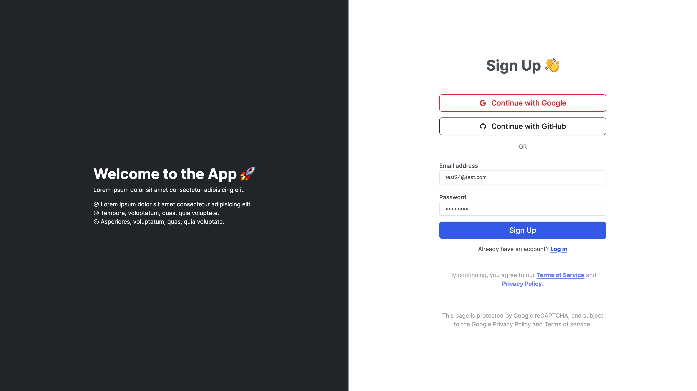
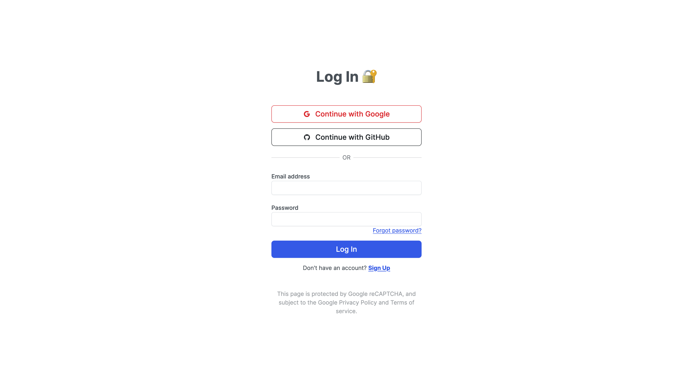
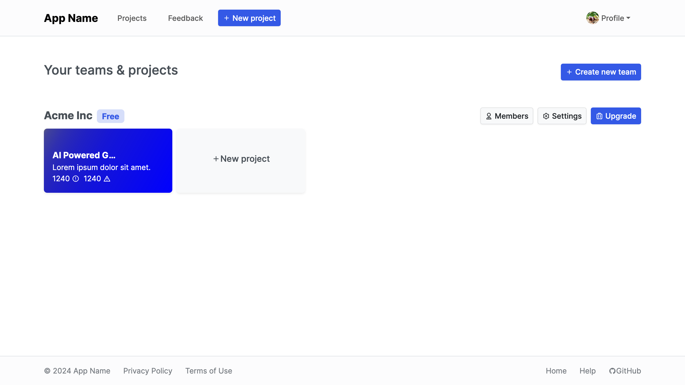
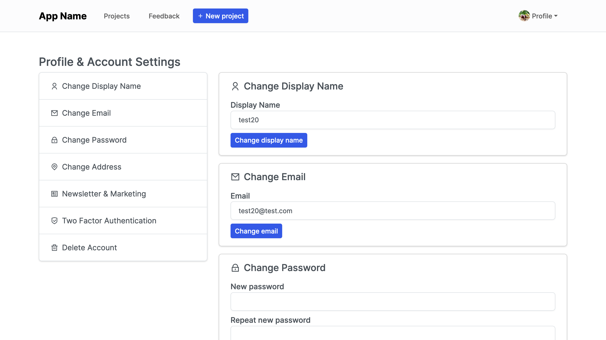
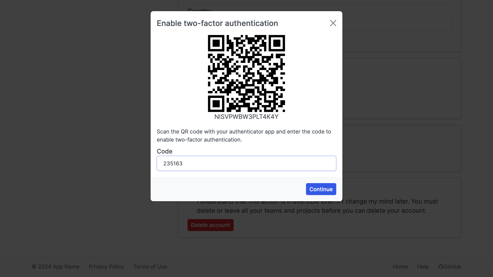
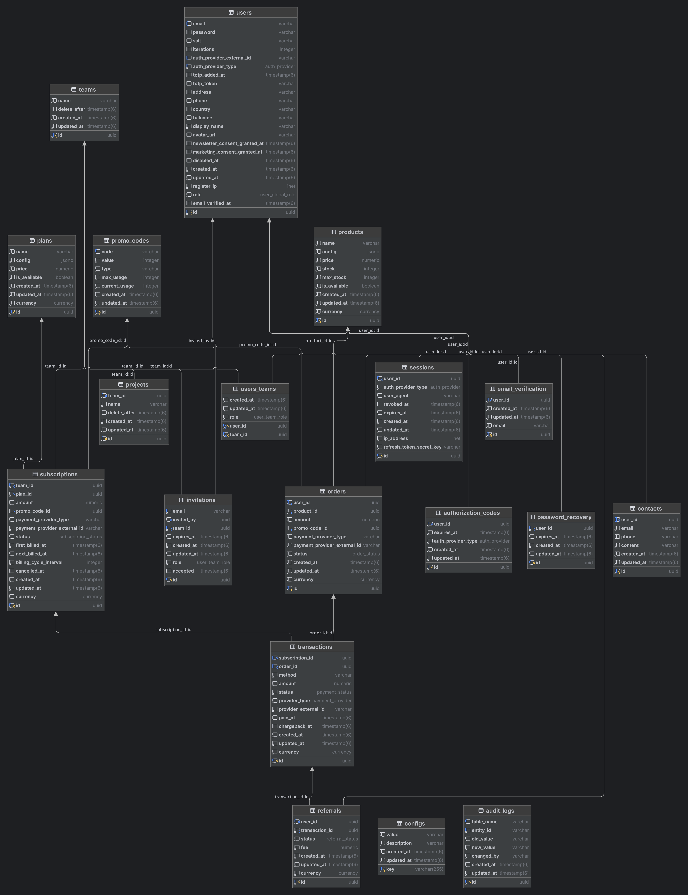

# saasy

Minimalistic boilerplate for SaaS applications. Made with Node, TypeScript, Express and Postgres on the server side and React + Vite on the client side.
Starter provides out-of-the-box authentication, team management and billing.

Every user can create a team and invite other users to join the team. Each team has a role assigned to each user.
Teams can be used to group users and manage projects.

### Features
* Email, Google and GitHub login
* Two-factor authentication
* Code-based email verification
* Forgot and reset password
* JWT and refresh tokens
* SMTP email service
* Teams management: create, invite, join
* Role-based access control
* Project management
* Account and profile settings
* Newsletter & marketing subscription
* Minimum dependencies
* Client with React and Vite
* Server with Node, Express and Postgres
* TypeScript everywhere

### Getting Started
```shell
# Clone the repository
git clone https://github.com/pilotpirxie/saasy.git

# Install dependencies
cd saasy && yarn

# Copy .env.example to .env and fill in the environment variables
cp .env.example .env

# Run server
yarn server

# Run client in another terminal
yarn client
```

### Screenshots











### Schema Diagram



### License
MIT